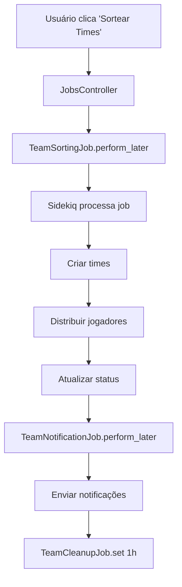
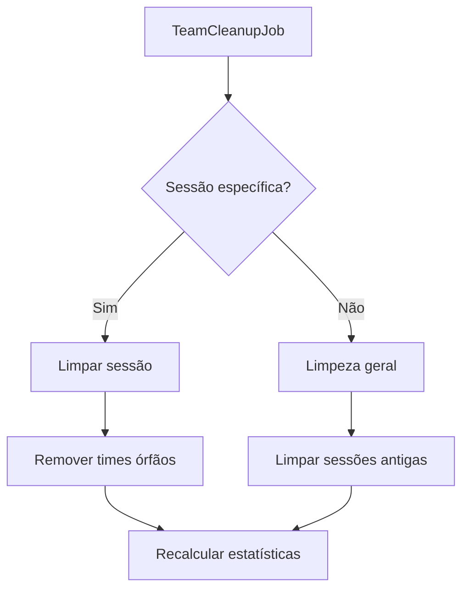

# Sidekiq Jobs - Sistema de Sorteio de Times

## Visão Geral

O sistema utiliza Sidekiq para processar jobs em background, melhorando a performance e experiência do usuário ao executar operações pesadas de forma assíncrona.

## Jobs Implementados

### 1. TeamSortingJob
**Fila**: `default`  
**Função**: Processa o sorteio automático de times

#### Funcionalidades
- Valida se a sessão pode ser iniciada
- Limpa atribuições existentes
- Cria times automaticamente
- Distribui jogadores de forma equilibrada
- Atualiza status da sessão
- Enfileira job de notificação

#### Parâmetros
- `game_session_id`: ID da sessão de jogo
- `players_per_team`: Número de jogadores por time (padrão: 5)

#### Exemplo de Uso
```ruby
# Enfileirar job
TeamSortingJob.perform_later(game_session.id, 5)

# Executar imediatamente
TeamSortingJob.perform_now(game_session.id, 5)
```

### 2. TeamNotificationJob
**Fila**: `notifications`  
**Função**: Envia notificações sobre times sorteados

#### Funcionalidades
- Agrupa jogadores por time
- Simula envio de notificações
- Loga informações dos times
- Enfileira job de limpeza

#### Parâmetros
- `game_session_id`: ID da sessão de jogo

#### Exemplo de Uso
```ruby
TeamNotificationJob.perform_later(game_session.id)
```

### 3. TeamCleanupJob
**Fila**: `maintenance`  
**Função**: Limpeza e manutenção de dados

#### Funcionalidades
- Remove times órfãos
- Remove atribuições inválidas
- Limpa sessões antigas (30+ dias)
- Recalcula estatísticas

#### Parâmetros
- `game_session_id`: ID da sessão (opcional, se nil limpa todas)

#### Exemplo de Uso
```ruby
# Limpar sessão específica
TeamCleanupJob.perform_later(game_session.id)

# Limpeza geral
TeamCleanupJob.perform_later

# Agendar limpeza
TeamCleanupJob.set(wait: 1.hour).perform_later(game_session.id)
```

## Configuração do Sidekiq

### Gemfile
```ruby
gem "sidekiq", "~> 7.0"
```

### Configuração do Active Job
```ruby
# config/application.rb
config.active_job.queue_adapter = :sidekiq
```

### Configuração do Sidekiq
```yaml
# config/sidekiq.yml
---
:concurrency: 5
:queues:
  - [default, 1]
  - [notifications, 2]
  - [maintenance, 3]

:max_retries: 3
:retry_interval: 60

:logfile: log/sidekiq.log
:pidfile: tmp/pids/sidekiq.pid

:verbose: true
```

## Como Executar

### 1. Instalar Dependências
```bash
bundle install
```

### 2. Iniciar Sidekiq
```bash
# Desenvolvimento
bundle exec sidekiq

# Com configuração específica
bundle exec sidekiq -C config/sidekiq.yml
```

### 3. Interface Web (Opcional)
Adicionar ao `config/routes.rb`:
```ruby
require 'sidekiq/web'

Rails.application.routes.draw do
  mount Sidekiq::Web => '/sidekiq'
end
```

## Interface de Gerenciamento

### Controller: `JobsController`
- **Index**: Lista sessões e status dos jobs
- **Sort Teams**: Enfileira job de sorteio
- **Send Notifications**: Enfileira job de notificação
- **Cleanup Session**: Enfileira job de limpeza
- **Status**: Retorna status dos jobs em JSON

### View: `/jobs`
- Dashboard com status dos jobs
- Lista de sessões com ações
- Botões para executar jobs
- Atualização automática de status

## Fluxo de Jobs

### Sorteio de Times


### Limpeza Automática


## Monitoramento

### Logs
- Jobs logam suas ações com emojis para fácil identificação
- Logs salvos em `log/sidekiq.log`
- Erros são capturados e logados

### Status dos Jobs
```ruby
# Verificar filas
Sidekiq::Queue.new.size           # Jobs pendentes
Sidekiq::ScheduledSet.new.size    # Jobs agendados
Sidekiq::RetrySet.new.size        # Jobs em retry
```

### Interface Web
- Acessível em `/jobs`
- Atualização automática a cada 30 segundos
- Botões para executar ações

## Tratamento de Erros

### Retry Automático
- Máximo de 3 tentativas
- Intervalo de 60 segundos entre tentativas
- Jobs em erro vão para fila de retry

### Logs de Erro
```ruby
begin
  # Lógica do job
rescue => e
  Rails.logger.error "❌ Erro no job: #{e.message}"
  Rails.logger.error e.backtrace.join("\n")
  false
end
```

## Vantagens do Sidekiq

1. **Performance**: Operações pesadas não bloqueiam a interface
2. **Escalabilidade**: Múltiplos workers podem processar jobs
3. **Confiabilidade**: Retry automático e tratamento de erros
4. **Monitoramento**: Interface web e logs detalhados
5. **Flexibilidade**: Diferentes filas para diferentes prioridades

## Exemplos de Uso no Console

```ruby
# Enfileirar sorteio
game_session = GameSession.find(1)
TeamSortingJob.perform_later(game_session.id, 5)

# Verificar status
Sidekiq::Queue.new.size

# Executar job imediatamente (para testes)
TeamSortingJob.perform_now(game_session.id, 5)

# Agendar job
TeamCleanupJob.set(wait: 1.hour).perform_later

# Limpar filas (cuidado!)
Sidekiq::Queue.new.clear
```

## Próximos Passos

### Possíveis Melhorias
1. **Notificações Reais**: Integrar com email, SMS, push notifications
2. **Webhooks**: Notificar sistemas externos
3. **Métricas**: Adicionar métricas de performance
4. **Cache**: Invalidar cache automaticamente
5. **Relatórios**: Gerar relatórios em background 